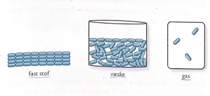
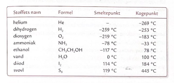
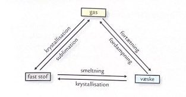
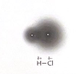
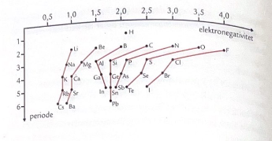

# Kemi Master Dokumentet
Dette er dokumentet som skal redde mig fra Kemi C. Nu lægger jeg en masse energi i det, så nu har jeg bare at skulle op til eksamen i det til sommer.

# Mærkning af farlige kemikalier

# Grundstoffer

**Grundstoffer**:
* et grundstof er et stof, som ikke kan spaltes mere, f.eks hydrogen og oxygen. 
* Et grundstof består af ens atomer.

**Kemiske forbindelser**:
* Hvis et stof ikke er et grundstof, er det en kemisk forbindelse, AKA en kombination af grundstoffer. 

## Reaktionsskemaer
Reaktionsskemaer bruges til at beskrive den måde man omdanner stoffer til andre stoffer. 

Når man laver et reaktionsskema, bruger man en pil istedet for et lighedstegn i mange tilfælde. Grunden til man gør det, er fordi det viser retningen af reaktionen. f.eks:

$$2H_2 + O_2 → 2H_2O$$

I eksemplet ovenover laver man hydrogen og oxygen om til vand, og ikke omvendt. Derfor bruger man pilen.

### Afstemning af reaktionsskemaer

Et reaktionsskema skal altid være afstemt. Dvs at der skal være lige mange af de forskellige grundstoffer på begge sider af pilen. F.eks:rrr

$$H_2 + O_2 → H_2O$$
$$2H_2 + O_2  → 2H_2O$$

I det her eksempel er den øverste formel ikke afstemt, og den nederste formel er afstemt.  

### Tilstandsformer 

I et reaktionsskema vi man ofte angive den tilstandsform som den kemiske forbindelse er i. De forskellige tilstandsformer er: 
* fast stof (s)
* væske (l)
* gas (g)

$$2H_{2(g)} + O_{2(g)}  -> 2H_2O_{(g)}$$

Man angiver også hvis at stoffet er opløseligt i vand. Det går man med $(aq)$. 

## Atomets opbygning

Et atom består af 3 grunddele: Protoner, Neutroner, og elektroner. 

**Elektroner:**
* er negativt ladet 
* masse = 0,00055 u

**Protoner:**
* er positivt ladet 
* masse = 1,0073 u

**Neutroner:**
* er neutrale. 
* masse = 1,0087 u 

## Atommasse

* Atommasse måles i enheden u. 
* $1u=\frac{1}{12}$ af $^{12}_6C$-atomets masse. 

når man skal udregne gennemsnitsmassen af et grundstof, tager man 100.000 atomer af et grundstof, og finder ud af hvor mange af de forskellige fer der vil være i, og regne den gennemsnitlige atomvægt ud, f.eks for carbon: 
$$\frac{98892*12,00000+1108*13,00335}{100000} = 12,011u$$

## Grundstoffernes periodesystem
Det periodiske system kan opdeles i 2 grupper: Hovedgrupper, og undergrupper. Hovedgrupperne består af gruppe 1+2, og 13-18. Undergrupperne består af de resterende grupper. 

Hovedgrupperne kan sorteres på x-aksen efter hvor mange elektroner de har i yderste skal, og på y-aksen efter mængden af protoner. 

## Atomernes elektronsystem
Elektroner ligger i "skaller" rundt om atomet. Hvor mange elektroner som der kan være i de forskellige skaller kan udregnes med formlen $2*n^2$, hvor $n$ er skallen. 

Den inderste skal kaldes K-skallen, og den næste L-skallen, osv ned af alfabetet. 

Strukturen af skallen i de første 18 grundstoffer er lineær; den fylder den inderste kerne helt op, før den går i gang med den næste. Efter de første 18 bliver det mere kompliceret. 

### Oktetreglen

Grundstofferne i Hovedgrupperne vil oftest danne bindinger på sådan en måde, så de opfylder oktetreglen. Man siger, at alle grundstofferne gerne vil blive til ædelgasser. Dvs at et grundstof i hovedgruppe 6  vil oftest gå sammen med et grundstof fra gruppe 2, så de kan opfylde oktetreglen sammen. 

# Ioner og ionforbindelser
En ionforbindelse er en binding mellem et ikke-metal og et metal grundstof. 

En ion er et stof, som mangler/ har for mange elektroner. 

Elektroner kan ikke eksistere frit. Derfor vil et grundstof kun afgive sin elektron, hvis der er et andet grundstof, som kan tage den. 

Et eksempel er Natriumchlorid. Der afgiver natrium en elektron, og chlor optager den elektron.
$$Na+Cl → Na^+ + Cl^-$$

* Chlor bindes sammen til $Cl_2$ molekyler, så derfor skriver man formlen sådan her: 

$$2Na_{(s)}+Cl_{2(g)}→2NaCl_{(s)}$$

* Ionbindinger er enormt stærke, og derfor har ionbindinger et meget højt smeltepunkt og fordampningspunkt. x

## Simple & Sammensatte ioner

Man skelner mellem _simple ioner_ og _sammensatte ioner_. Simple ioner består kun af et enkelt atom, hvor sammensatte ioner består af flere forskellige atomer. 

Eksempler på simple ioner: 
* $N^{3-}$ = nitrid
* $O^{2-}$ = oxid
* $S^{2-}$ = sulfid
* $P^{3-}$ = Phosphid

Eksempler på Sammensatte ioner: 
* $SO^{2-}_4$ = Sulfat

### simple ioner

Når man snakker simple ioner, Så afgiver Metalatomer elektroner og danner positie ioner, mens ikke metaller optager elektroner, og danner negative ioner.

De fleste hovedgruppegrundstoffer danner ioner i overensstemmelse med oktetreglen. DVS at metalatomerne i gruppe 1-4 afgiver elektroner, og atomerne i gruppe 5-8 optager elektroner.

Bly og tin kan danne flere forskellige ioner, så derfor angiver vi ionladningen:
* $Pb^{2+}$ = bly(II)ion
* $Sn^{2+}$ = tin(II)ion
* $Sn^{4+}$ = tin(IV)ion

### Sammensatte ioner

En sammensat ion består af flere forskellige atomer, som er bundt sammen. 

**Eksempler:**
* $OH^-$ = hydroxid
* $SO_4^{2-}$ = sulfat
* $CO_3^{2-}$ = carbonat
* $PO_4^{3-}$ = phosphat
* $NO_3^-$ = nitrat
* $NH_4^+$ = ammonium

**Jeg skal kunne ovenstående udenad.**

Hvis et grundstof danner flere forskellige oxygenholdige ioner, angiver -it et lavere oxygenindhold end -at, f.eks:
* $SO_3^{2-}$ = sulfit
* $SO_4^{2-}$ = sulfat
* $NO_2^-$ = nitrit
* $NO_3^+$ = nitrat

**Eksempel på sammensat ionforbindelse:**
$$Al^{3+}+SO_4^{2-}→Al_2(SO_4)_3$$

### Krystalvand

Nogle gange sidder der vandmolekyler mellem ionerne i et iongitter. Det kalder man for krystalvand. f.eks:
$$Na_2SO_4*10H_2O$$

I ovenstående stof er der 10 vandmolekyler for hver 2 natriumioner og 1 sulfat. når der ved siden af navnet på et stof står (1/6) eller lignende, så betyder det at der er 6 molekyler vand for hver formelenhed. 

## Fældningsreaktioner
Fældningsreaktioner er en kemisk reaktion med salte, som skaber bundfald. Når vi arbejder med salte og fældningsreaktioner, så er det altid i vand. 

et eksempel på en fældningsreaktion er når man blander sølv(I)nitrat ($AgNO_3$) med natriumchlorid. Så får man Sølv(I)chlorid (AgCl), som er tungtopløseligt.

**Skema over opløselighed:**

 

## Exoterme og endoterme reaktioner
* Exoterme reaktioner _afgiver_ energi. 
* Endoterme reaktioner _optager_ energi.

Man konstanterer om en reaktion er endoterm eller exoterm ved at måle temperatur på den væske som reaktionen tager sted i, f.eks.

# Kovalent binding

## Rækkefølge
Når man skriver kemiske forbindelser, der består af 2 ikke-metaller, så skriver man de 2 grundstoffer i denne rækkefølge:
1. $B$
2. $Si$
3. $C$
4. $As$
5. $P$
6. $N$
7. $H$ 
8. $Te$
9. $Se$
10. $S$ 
11. $O$ 
12. $At$
13. $I$
14. $Br$ 
15. $Cl$ 
16. $F$

* når man skal navngive et stof, så sætter man grundstofferne sammen i rækkefølgen dikteret ovenfor, og det sidste grundstof skal så slutte på "id". 

**forskel på ionbinding og kovalent binding:**
|Ion|Kovalent|
|-|-|
|Metal+ikke-metal|ikke metaller|
|afgiver & optager $e^-$| Deles om $e^-$|
|Formelenhed|molekyle|
|navngives ikke med antal|navngives med antal

**Talforstavelser:**

1. mono-
2. di-
3. tri-
4. tetra- 
5. penta-
6. hexa- 
7. hepta- 
8. octa- 
9. nona- 
10. deca. 

* kovalente bindinger slutter også på id (?), men man bruger kun id når man sætter grundstoffet sammen med et andet. 

* en kovalent binding opfylder stadig oktetreglen: den deler bare elektronen.

## Elektron-prik-formel

**Eksempler på Kovalente bindinger og deres elektronprikformler:**

* når man skal tegne kovalente bindinger, så skal man tegne den yderste skal. DVS at oxygen har 6 prikker, og hydrogen har 1 prik.

* et atom kan kun binde sig, hvis der er et ledigt elektron, aka at der ikke er et elektronpar. 

Når man skal beskrive den rumlige opbygning af de tre molekyler, så skal man bruge en figur som hedder en tetraeder, som ser sådan her ud:

Man skal forstille sig at hovedatomet sidder i midten af tetraeden, og hjørnerne så er de mulige tilslutningssteder som der er. 
**vinkler baseret på antal tilslutninger:**
1. 0°
2. 104,5°
3. 107,3°
4. 109,5°

## Rumlige formler

Rumlige formler er hvordan man kan skrive en formel for en kovalent binding, så man ved hvordan den ser ud i 3D.
* Normal linje = fronten af tegningen
* stiplet linje = binding bagud
* kile = binding fremad

## Molekyler
* Fast tilstandsform = molekyler sidder i et gitter
* Flydende tilstandform = kan bevæge sig rund mellem hinanden
* gas-tilstandsform = kan bevæge sig fuldkommen frit

**Smeltepunkt og Kogepunkt for forskellige stoffer:**

Molekylernes opbygning

## Forskellige bindinger
* Enkeltbindinger = $Cl_2$, der er grundstofferne kun bundet med 1 elektron hver.
* Dobbeltbindinger = $CO_2$, der er C og O forbundet med 2 elektroner hver. 
* Trippeltbindinger = $N_2$, der er nitrogen bundet med 3 elektroner.

## Ændring i tilstandsform

## Grundstoffet Carbon
**Forskel på diamant og grafit:**
* Diamant består af 5 carbon molekyler, og grafit består kun af 4.
* Diamant's gittermodel ligner en tertaeder, hvor carbon's er flade dele med vinkler på 120 grader. 

* De har begge to et smeltepunkt på over 3500 grader C. 

## Elektronnegativitet

Hvis man tager f.eks $H_2$, så ejer hvert af H-atomerne 50% af det fælles elektronpar. Hvis man derimod kigger på $H-Cl$, så vil $Cl$ atomet trække mere i elektronparret end $H$ vil. Derfor siger man, at chlor er mere elektronnegativt end hydrogen er.

Man bruger $δ$ (delta) til at angive positiv og negativ elektronnegativitet sammenlignet med andre atomer. f.eks:
$$H^{δ+}Cl^{δ-}$$
(ikke den rigtige måde at skrive det på, se billede:)

* de små ladninger kalder man for delladninger, og en binding af den her slags kalder man for en polær kovalent binding.

***Skema over polære kovalente bindinger:**

# Mængdeberegninger

## Densitet

* Densitet skrives med ρ (rho).
$$ρ=\frac{m}{V}$$

$$H_2O=(1,008*2)+16,00=18,016u$$
$$C_2H_5OH=(12,011*2)+(1,008*6)+15,94=46,01u$$
$$Na_2SO_4*10H_2O=$$

* Unit vægten af et stof vil være det samme som i gram, hvis man har præcis 1 mol af stoffet. 

* Avogadros konstant = et stof har molekylemassen $x$ u, og 1 mol af det stof har massen $x$ g, og en molar massen på $x$ g/mol. 

* symbolet for molarmasse = M (store m. )

* Det er den mindste mol som afgør hvad man får ud på den anden side. 

$$2C_8H_{18}+26O_2 =16CO_2+18H_2O$$

$$n = \frac{m}{M}$$

# Blandinger

# Indblik i organisk kemi

# Syre-basereaktioner

# Redoxreaktioner